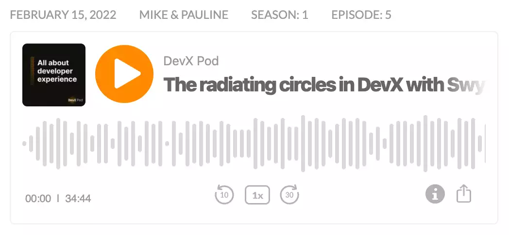

**Welcome to DevX Digest - the place to hear all about Developer Experience**, brought to you by Pauline Narvas [(@paulienuh)](https://twitter.com/paulienuh) and Mike Nikles [(@mikenikles)](https://twitter.com/mikenikles) from Gitpod. You're reading another newsletter from us 🎉! In this edition, we talk about developer experience in cloud-based,ephemeral dev environments.

Last week on DevXPod, we sat down with [Shawn Wang (aka Swyx) ](https://twitter.com/swyx)to hear his thoughts on what makes developer experience. For those that have not heard of Shawn before, he’s currently the Head of Developer Experience at [Temporal](https://twitter.com/Temporalio) and is well known for the learning in public movement and for speaking about React and Severless.

As usual, in today’s newsletter, we’ll be sharing some of our key takeaways from the podcast episode. If you’d like to listen to the full episode, head over to your favourite podcast platform and search for `DevXPod`. Don’t forget to subscribe and leave us a rating ⭐️Alternatively, if you’d prefer to read a transcript of our conversation head over to [our Buzzsprout site](https://devxpod.buzzsprout.com)!

_DevX Pod is available wherever you get your podcasts!_

### Key Takeaways

Developer Experience is like a **radiating circle out from the core product.** ⭕️ Shawn describes it as:

> _"You start with the core product, you make sure that API design solid. Then you radiate out into the docs. And then you go from the first party content, which is your blog posts and talks. Then community, which is going from one to many communication to many, to many communication. Having a place where your users talk to other users and help each other out. And then the final tier is enabling third-party content, which is users writing blog posts and books, workshops, courses and tutorials about you, even posting jobs with your tool or your technology in the job description on anything like this, where it's very user initiated."_

Keeping developers engaged from the beginning with a “wow” moment is also part of this, **if your end-to-end experience helps keep developers curious and in flow,** they are as a result much more productive.

It’s clear that developer experience covers more than just your core product. Experiences around it are also equally as important. The radiating circle analogy is spot on! We’ll certainly be using this from now. 🎯

In the DevX world, we often talk about the happy paths i.e. how fast something is and how much it’s improved their workflow. **However, “_Developer Exceptions_” is as equally as important.** What do we do when things go wrong? Thinking about this is just as vital for a good developer experience. This covers more of the “boring” things for example, work on observability, clear deprecation support policies, etc. 👀

When it comes to the importance of developer experience, **accessibility for folks getting into the space was once again front and centre.** Shawn shared that he thinks it’s important especially as a career switcher into tech himself.

Shawn’s pick in favourite developer experience is anything that makes **cycles faster, reduced feedback loops and with lots of customisation options.**

**The future of developer experience is looking bright!** ✨ Video format was mentioned again in this episode, especially with the rise of short-form videos like TikTok. There are challenges that come with video format _(e.g. outdated very quickly)_ but it’s still a space that will only continue to grow. 📹

Shawn shared some of his thoughts on where he thought it is going, building on the radiating circle analogy.

> _"In line with the model that we've been developing, either you integrate forward or integrate backwards. In other words,typically developer experience is very tied to developer relations and a lot of first party content creation. So you integrate forward, meaning that talk a little bit more with community, you take on more community management roles or you encourage more, third party content by holding workshops and stuff like that. Or you integrate backwards, which is you get more involved with products. So I think that's an interesting way to think about this in terms of the radiating circles, but the other way to think about it as well is what's the shift within the content creation meta game, which I think about a lot as well."_

### DevX Digest is community-driven 🤝

Another thing about Gitpodders is that we’re all driven by community feedback, and this newsletter is no exception! Please send us your thoughts, feedback and help us navigate this conversation. We may even feature some of your takes and comments in future newsletters!

Come and hang out with us over on [our Discord](https://www.gitpod.io/chat). 👋🏼
