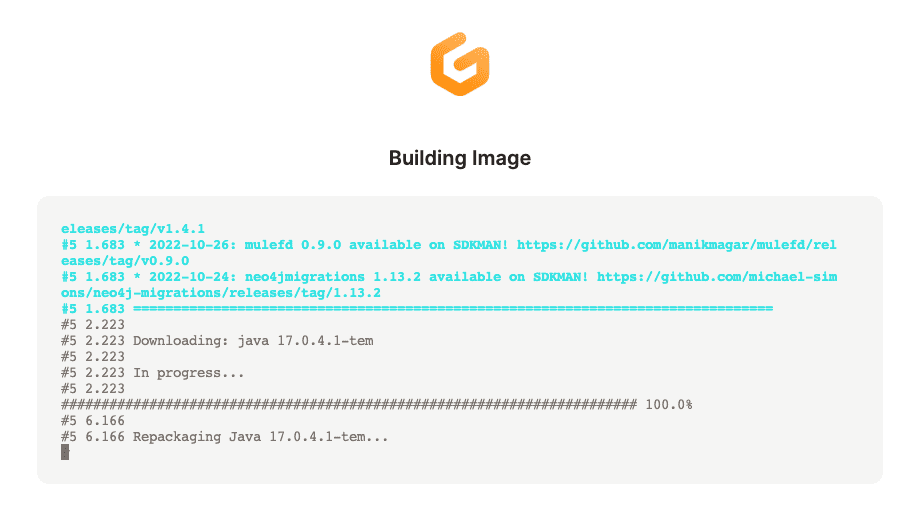

<script context="module">
  export const prerender = true;
</script>

[Gitpod(https://www.gitpod.io/) workspace image (the image on which your environment runs) comes with preinstalled Java development tools like [SDKMan](https://sdkman.io/), https://maven.apache.org/ and [Gradle](https://gradle.org/).

When you execute `java --version` in the terminal, you'll find out that the current Java version is Java 11 (at the time of writing this blog post).

Since [SDKMan](https://sdkman.io/) is installed, you can easily switch to a different Java version with:

`$ sdk install java 17.0.4.1-tem`

But this change will be reflected only in your current workspace. If someone else opens Gitpod workspace for the same Gitpod repository or if you recreate workspace, Java will be back to 11 and the version you installed with SDKMan will be gone.

There are at least two ways how tou can to configure Java version for each new Gitpod workspace.

## Set Java version with .gitpod.yml

Gitpod workspace can be configured with `.gitpod.yml`. There we set the commands that are executed when workspace is created:

```
tasks:
  - before: sdk install java 17.0.4.1-tem
```

This is almost good. The problem is that `sdk install` prompts user to set the installed version as a default. There's no flag to run the command in non-interactive mode, but there is a [hacky workaround](https://github.com/sdkman/sdkman-cli/issues/101#issuecomment-155938383):

```
tasks:
  - before: sdk install java 17.0.4.1-tem < /dev/null
```

The drawback is that this command takes some time to run and is executed every time the workspace is created.

Instead, we can create a custom workspace image that will be built only once.

## Set Java version with workspace image

Gitpod gives an option to use [custom Docker image](https://www.gitpod.io/docs/configure/workspaces/workspace-image) on which the workspace runs. Let's create one that uses Java 17 by default:

Remove the `before` task from `.gitpod.yml` and instead set the `image.file` property to `.gitpod.Dockerfile.`

```
image:
  file: .gitpod.Dockerfile
```

Next, create a file `.gitpod.Dockerfile`. If you are happy with the default Gitpod workspace image, you can use it as a base.

```
FROM gitpod/workspace-full:2022-10-25-06-57-58

SHELL ["/bin/bash", "-c"]
RUN source "/home/gitpod/.sdkman/bin/sdkman-init.sh"  \
    && sdk install java 17.0.4.1-tem < /dev/null
```

Let's break it down:

1. It is recommended to use a specific Docker image tag for a base image. Go to https://hub.docker.com/r/gitpod/workspace-full and look for the latest tag, then use it in FROM command in the Dockerfile.
2. Change shell to bash, source SDKMan init so that `sdk` command becomes available, and run `sdk install` like we previously did in the `.gitpod.yml`:

Then, when you create a new repository with these files, only on the first run, Gitpod builds an image:



.. and once the workspace is ready:

```
$ java --version
Picked up JAVA_TOOL_OPTIONS:  -Xmx3489m
openjdk 17.0.4.1 2022-08-12
OpenJDK Runtime Environment Temurin-17.0.4.1+1 (build 17.0.4.1+1)
OpenJDK 64-Bit Server VM Temurin-17.0.4.1+1 (build 17.0.4.1+1, mixed mode, sharing)
```

## Use JDK unavailable in SDKMan

What if the JDK we want to use is not available in SDKMan? Since we use Dockerfile, we can write shell scripts.

As an example, lets use CRaC distrubution of the OpenJDK.

```
FROM gitpod/workspace-full:2022-10-25-06-57-58

SHELL ["/bin/bash", "-c"]

RUN wget https://github.com/CRaC/openjdk-builds/releases/download/17-crac%2B3/openjdk-17-crac+3_linux-x64.tar.gz
RUN sudo tar zxf openjdk-17-crac+3_linux-x64.tar.gz \
    && sudo mv openjdk-17-crac+3_linux-x64 /opt/
RUN echo 'export JAVA_HOME=/opt/openjdk-17-crac+3_linux-x64/' >> /home/gitpod/.bashrc \
    && echo 'export PATH=/opt/openjdk-17-crac+3_linux-x64/bin:$PATH' >> /home/gitpod/.bashrc
```

Let's break it down:

1. Download OpenJDK [CRaC](https://openjdk.org/projects/crac/) release from https://github.com/CRaC/openjdk-builds/releases/
2. Unpack it and move to /opt/

Now, two important points:

3. Export JAVA_HOME effectively overwriting one set by SDKMan
4. Add JDK bin directory to $PATH. It is important to put it before what's already been there so that the new JDK bin is before the SDKMan path.

Once you recreate the workspace, and the new image is built:

```
$ java -version
Picked up JAVA_TOOL_OPTIONS:  -Xmx3489m
openjdk version "17-crac" 2021-09-14
OpenJDK Runtime Environment (build 17-crac+3-15)
OpenJDK 64-Bit Server VM (build 17-crac+3-15, mixed mode, sharing)
```

That's all folks!
